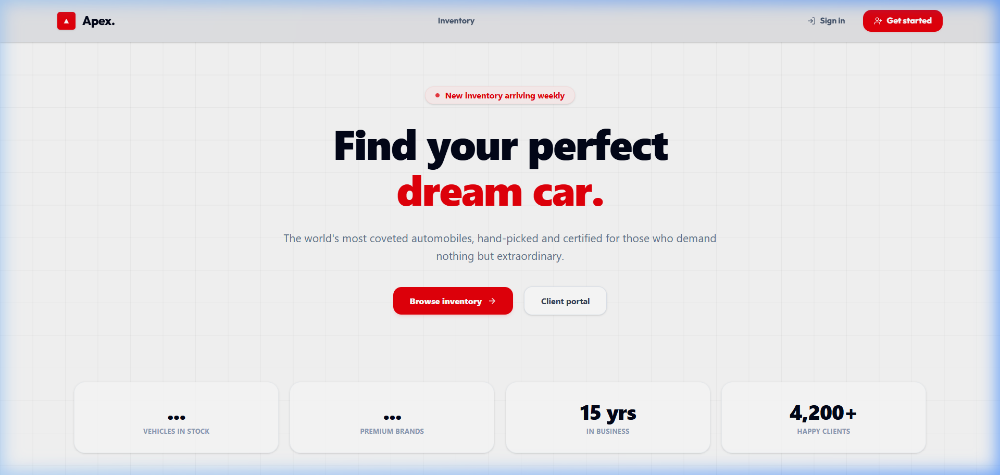
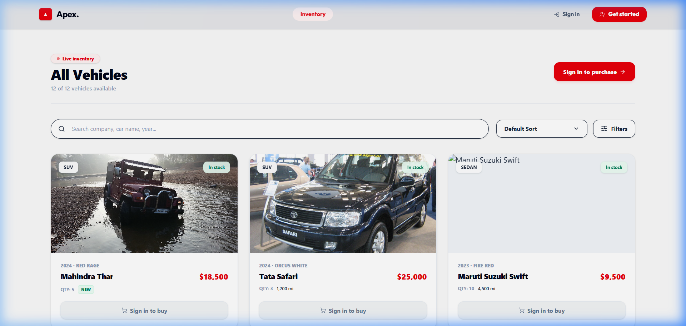
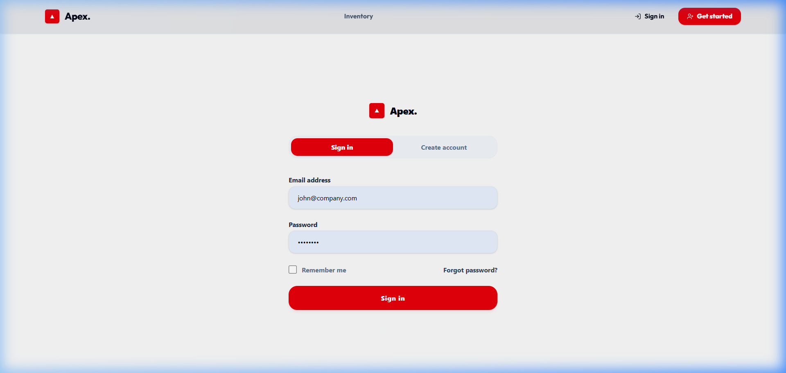
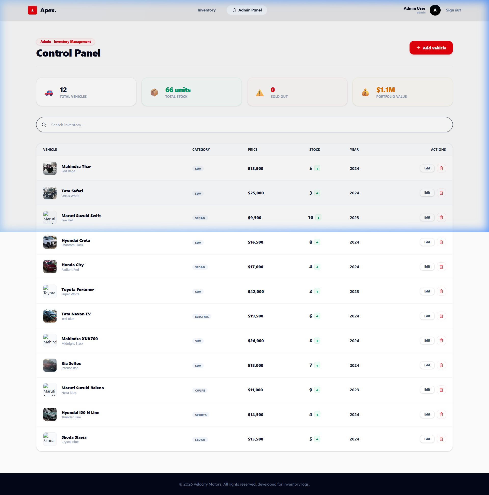

# 🚗 Car Dealership Inventory System

A comprehensive, production-ready **Car Dealership Inventory Management System** built with **Java Spring Boot**, **React (TypeScript + Vite)**, and **MongoDB**. The project follows **Clean Architecture** principles and **Test-Driven Development (TDD)** to deliver a reliable, secure, and user-friendly experience.

🚀 **Live Demo**: [car-inventory-system.vercel.app](https://car-inventory-system.vercel.app/)

🌐 **Deployment Hosting**:
* **Frontend**: Vercel
* **Backend**: Render/Railway
* **Database**: MongoDB Atlas

---
## 🌟 Key Features

### 🔐 Authentication & Authorization
- Secure JWT-based authentication with BCrypt password encryption.
- Role-Based Access Control (RBAC):
  - **USER:** Browse, search, and purchase vehicles.
  - **ADMIN:** Manage inventory, pricing, and stock operations.
- Protected frontend routes and backend APIs based on user roles.
- Persistent login sessions with token-based authorization.

### 🚘 Vehicle Catalog & Search
- Responsive vehicle inventory dashboard with modern card-based UI.
- Advanced multi-filter search by:
  - Make
  - Model
  - Category
  - Price Range
- Detailed vehicle information including price, year, mileage, color, and stock availability.
- Dynamic vehicle images and real-time inventory updates.

### 📦 Inventory Management & Transactions
- Purchase vehicles directly through the application.
- Automatic stock deduction after successful purchases.
- Real-time out-of-stock validation and purchase prevention.
- Full CRUD operations for administrators:
  - Add Vehicles
  - Update Vehicle Details
  - Delete Vehicles
  - Restock Inventory
- Inventory synchronization between frontend and database.

---

## 🏗️ System Architecture
┌────────────────────────────────────┐
│      Frontend (React + Vite)       │
│  React Query • Axios • Tailwind    │
└────────────────┬───────────────────┘
                 │ HTTPS / REST API
                 ▼
┌────────────────────────────────────┐
│      Spring Security (JWT)         │
│ Authentication & Authorization     │
└────────────────┬───────────────────┘
                 ▼
┌────────────────────────────────────┐
│         REST Controllers           │
└────────────────┬───────────────────┘
                 ▼
┌────────────────────────────────────┐
│         Service Layer              │
│ Business Logic & Validation        │
└────────────────┬───────────────────┘
                 ▼
┌────────────────────────────────────┐
│       Repository Layer             │
│      Spring Data MongoDB           │
└────────────────┬───────────────────┘
                 ▼
┌────────────────────────────────────┐
│      MongoDB Atlas / Local DB      │
└────────────────────────────────────┘
## 🛠️ Technology Stack

- **Frontend:** React 19, TypeScript, Vite, Tailwind CSS, Axios, TanStack React Query, React Router DOM
- **Backend:** Java 22, Spring Boot 3.x, Spring Security, JWT Authentication, Spring Data MongoDB, Lombok, Maven
- **Database:** MongoDB Atlas (Cloud) / MongoDB Community Server (Local)
- **Testing:** JUnit 5, Mockito, Vitest, React Testing Library
- **Deployment:** Vercel (Frontend), MongoDB Atlas, Docker-ready backend architecture

---

## 📂 Project Structure

```text
Car-Inventory-System
│
├── backend
│   ├── src/main/java
│   ├── src/test
│   └── pom.xml
│
├── frontend
│   ├── src/components
│   ├── src/pages
│   ├── src/services
│   ├── src/tests
│   └── package.json
│
├── screenshots
└── README.md
```

---

## 🔗 Important APIs

| Method | Endpoint | Description |
|:---:|:---|:---|
| **POST** | `/api/auth/login` | User Authentication (Returns JWT) |
| **POST** | `/api/auth/register` | Register New Account |
| **GET** | `/api/vehicles` | Retrieve Seeded Vehicle Catalog |
| **POST** | `/api/vehicles` | Add New Vehicle (Admin Only) |
| **PUT** | `/api/vehicles/{id}` | Modify Vehicle Details (Admin Only) |
| **DELETE** | `/api/vehicles/{id}` | Remove Vehicle from Catalog (Admin Only) |
| **POST** | `/api/vehicles/{id}/purchase` | Purchase Vehicle (Deducts Stock) |
| **POST** | `/api/vehicles/{id}/restock` | Restock Vehicle Quantity (Admin Only) |

---

## 📸 Screenshots in Action

Here is a visual walk-through of the application:

### 1. Landing Page
*A sleek, modern hero page introducing the Velocity Motors brand with smooth call-to-actions.*


### 2. Vehicle Inventory Dashboard
*Browse through all available vehicles, search, and filter by criteria.*


### 3. Login Page
*Secure sign-in form for both users and administrators.*


### 4. Admin Control Panel
*Accessible only to administrators. Allows inventory restocking, adding/editing vehicle details, and stock monitoring.*


---
## 🛠️ Tech Stack & Dependencies

### Frontend
- **Core:** React 19, TypeScript, Vite 8
- **Styling:** Tailwind CSS 4, PostCSS, Lucide React
- **State Management & APIs:** TanStack React Query 5, Axios
- **Routing:** React Router DOM 7
- **Testing:** Vitest, React Testing Library, JSDom

### Backend
- **Core:** Java 22, Spring Boot 3.x, Maven
- **Security:** Spring Security, JWT Authentication, BCrypt
- **Database:** Spring Data MongoDB, MongoDB Atlas
- **Utilities:** Lombok
- **Testing:** JUnit 5, Mockito

### Tools & Deployment
- **Version Control:** Git, GitHub
- **API Documentation:** Swagger/OpenAPI
- **Frontend Deployment:** Vercel
---

## 🚀 Local Setup & Running Guide

### Prerequisites
* **Java Development Kit (JDK) 22** or higher.
* **Node.js** (v18+ recommended) and **npm**.
* **MongoDB** (Ensure MongoDB is running locally on port `27017` or use MongoDB Atlas).

---

### 1. Backend Setup

1. Navigate to the `backend` directory:
   ```bash
   cd backend
   ```

2. Create/update the `.env` file in the `backend` directory (if not already present):
   ```env
   JWT_SECRET=9a4f2c8d3b7a1e5f8c3d6b2a1c5d8e7f9a4f2c8d3b7a1e5f8c3d6b2a1c5d8e7f
   JWT_EXPIRATION=86400000
   ```

3. Build and run the Spring Boot server using the Maven wrapper:
   ```bash
   # Windows
   .\mvnw spring-boot:run
   
   # Linux/macOS
   ./mvnw spring-boot:run
   ```
   The backend will start and listen on port **`8080`**.
   * **API Docs / Swagger UI**: `http://localhost:8080/swagger-ui/index.html`

---

### 2. Frontend Setup

1. Navigate to the `frontend` directory:
   ```bash
   cd frontend
   ```

2. Install dependencies:
   ```bash
   npm install
   ```

3. Start the Vite development server:
   ```bash
   npm run dev
   ```
   The frontend will start and be available at **`http://localhost:5173`**.

---

### 🔑 Test Credentials (Admin & User)

The application automatically seeds a default set of Indian vehicles upon startup. You can log in using the following accounts:

* **Administrator Account**:
  * **Email**: `admin@gmail.com`
  * **Password**: `admin123`
* **Regular User Account**:
  * Register a new account on the **Register** page to immediately browse and purchase vehicles.

---
## 🧪 Test Report

The project includes automated unit tests to verify business logic, authentication workflows, inventory operations, and frontend component behavior. The testing strategy follows Test-Driven Development (TDD) principles to ensure reliability and maintainability.

---

### 🔧 Backend Testing

**Frameworks Used:** JUnit 5, Mockito

The backend test suite validates:

- User authentication and registration logic
- JWT-based authorization workflows
- Vehicle inventory management operations
- Business rule validations
- Stock updates and purchase transactions
- Service layer functionality and edge cases

#### Run Backend Tests

```bash
cd backend
./mvnw test
```

#### Backend Test Summary

| Test Class | Description | Status |
|------------|-------------|---------|
| AuthServiceTest | Authentication & Registration Logic | ✅ Passed |
| InventoryServiceTest | Inventory Management Operations | ✅ Passed |
| VehicleServiceTest | Vehicle CRUD & Business Rules | ✅ Passed |

**Results**

| Metric | Value |
|---------|--------|
| Total Tests | 11 |
| Passed | 11 ✅ |
| Failed | 0 ❌ |
| Errors | 0 ❌ |
| Build Status | SUCCESS ✅ |

---

### 🎨 Frontend Testing

**Frameworks Used:** Vitest, React Testing Library, JSDom

The frontend test suite validates:

- Component rendering
- Navigation behavior
- UI interactions
- Route protection and interface functionality

#### Run Frontend Tests

```bash
cd frontend
npm run test
```

#### Frontend Test Summary

| Test File | Description | Status |
|------------|-------------|---------|
| Navbar.test.tsx | Navigation Component Rendering | ✅ Passed |

**Results**

| Metric | Value |
|---------|--------|
| Total Tests | 1 |
| Passed | 1 ✅ |
| Failed | 0 ❌ |
| Errors | 0 ❌ |

---

### 📊 Overall Test Results

| Category | Result |
|-----------|---------|
| Backend Tests | ✅ 11/11 Passed |
| Frontend Tests | ✅ 1/1 Passed |
| Total Failures | ❌ 0 |
| Total Errors | ❌ 0 |
| Build Status | ✅ SUCCESS |

The successful execution of all automated tests confirms the correctness of authentication flows, inventory management operations, and frontend component behavior, ensuring a stable and production-ready application.


## 🤖 My AI Usage

During the development of this project, I paired with **Antigravity**, a Google DeepMind agentic coding assistant, to accelerate delivery and maintain clean code standards:

1. **Architecture & Database**:
   * Designed a decoupled backend schema for MongoDB.
   * Leveraged the AI to write boilerplate configurations (Spring Security configurations and database setup).
2. **Business & Security Logic**:
   * Integrated Spring Security and JWT authentication.
   * Designed the secure login flow incorporating hardcoded admin initializers and custom user registrations.
3. **Frontend Presentation**:
   * Co-authored the React state management logic using TanStack React Query for reliable caching and backend synchronization.
   * Utilized Tailwind CSS to create a premium glassmorphic UI design.
4. **Testing and Verification**:
   * Structured the unit test suite in JUnit 5 to achieve coverage across service validation code.
   * Orchestrated automated browser tests to capture application screenshots for review.
